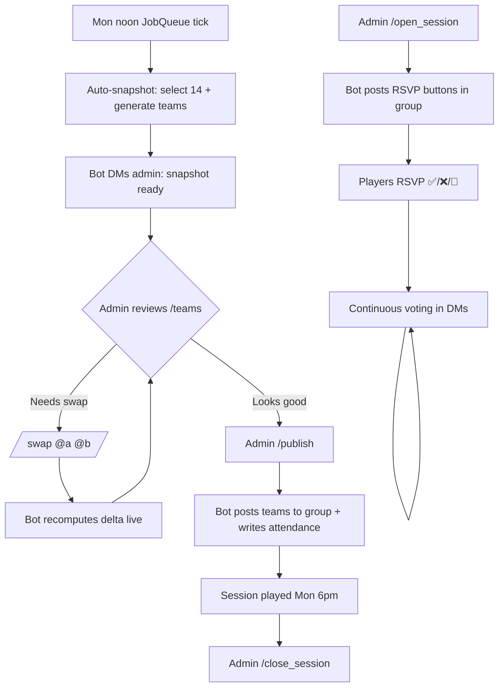
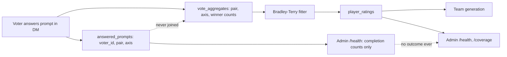
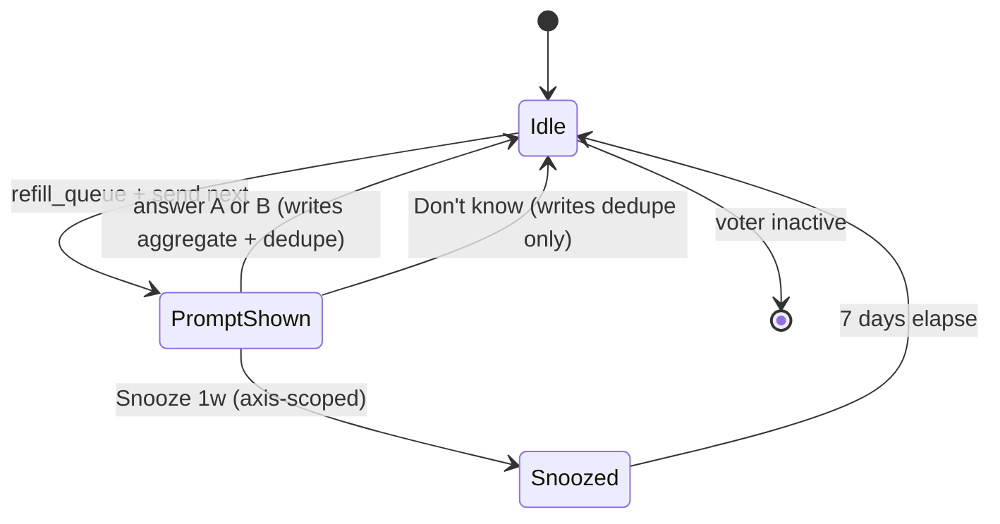

 # توپ — Volleyball team-balancing Telegram bot (MVP)

**Goal:** Ship a Telegram bot that manages weekly 6v6 volleyball sessions: roster, RSVP, private peer pairwise voting (3 skill axes), Bradley-Terry ratings, balanced team generation with admin override.
**Status:** in_progress
**Created:** 2026-05-14
**Execution:** Use `/execute-plan <path-to-this-file>` to run this plan task-by-task.

---

## Architecture

A single async Python process running `python-telegram-bot` with SQLite as the only persistence layer. Mirrors the layout of `~/Downloads/Coding/personal/persian-translator-bot`: `pydantic-settings` for env-based config, one module per concern (`db`, `handlers/`, `rating`, `selection`, `balance`, `voting_queue`), and a single entrypoint that wires command/callback handlers. All player-facing flows (RSVP, voting prompts) use inline-keyboard callbacks; admin flows are gated by a single `ADMIN_TELEGRAM_ID` check on every handler. Privacy is enforced at the data layer: votes are stored as pairwise outcome counts keyed by `(player_a, player_b, axis)`, never by voter identity — voter-side data only tracks "which prompts has this voter already answered" so the queue doesn't repeat itself.

---

## Phase 1 — Foundation (DB schema + config skeleton)

Establish the project layout, config, and persistence before any Telegram code.

- [x] **Task 1.1 — Project scaffolding**
  - Create `pyproject.toml` with deps: `python-telegram-bot[ext]>=22`, `pydantic-settings`, `python-dotenv`, `aiosqlite`, `numpy` (for Bradley-Terry fitting), `pytest`, `pytest-asyncio`
  - Add `.env.example` with placeholders: `BOT_TOKEN`, `ADMIN_TELEGRAM_ID`, `GROUP_CHAT_ID`, `SNAPSHOT_HOUR=12`, `SESSION_WEEKDAY=monday`, `MAX_ATTENDEES=14`, `WEIGHT_ATTACK=0.4`, `WEIGHT_DEFENSE=0.4`, `WEIGHT_SETTING=0.2`, `CALIBRATION_THRESHOLD=15`, `QUEUE_DEPTH=5`
  - Create `src/toop/{__init__,config,db,bot}.py` skeletons
  - Set up `.venv` and confirm deps install
  - Verify: `python -c "from toop.config import settings; print(settings)"` prints the loaded config

- [x] **Task 1.2 — SQLite schema + migrations**
  - Single `schema.sql` file applied idempotently on startup
  - Tables:
    - `players(telegram_id PK, username, display_name, joined_at, active, is_calibrating)`
    - `sessions(id PK, session_date, snapshot_at, status)` — status: `open`, `snapshotted`, `published`, `done`
    - `rsvps(session_id, telegram_id, status, locked_in, created_at)` — status: `yes`, `no`, `maybe`
    - `attendance(session_id, telegram_id, was_attendee)` — written when teams finalized; the source of truth for the fairness queue
    - `vote_aggregates(player_a, player_b, axis, a_wins, b_wins, updated_at)` — pairwise outcome counts; `player_a < player_b` invariant
    - `pending_prompts(voter_id, player_a, player_b, axis, created_at, info_gain)` — voter's standing queue
    - `answered_prompts(voter_id, player_a, player_b, axis, answered_at)` — voter-side dedupe; NO outcome stored here (outcome flows to aggregates only)
    - `snoozes(voter_id, snoozed_until)`
  - Indexes on `pending_prompts(voter_id, info_gain DESC)`, `vote_aggregates(player_a, player_b, axis)`
  - Verify: `pytest tests/test_db.py` — schema applies cleanly twice, foreign keys enforced

- [x] **Task 1.3 — Config validation + admin guard**
  - `pydantic-settings` validates: token present, admin_id is int, weights sum to 1.0 (warn if not), snapshot hour 0-23
  - `require_admin` decorator for handlers that checks `update.effective_user.id == settings.ADMIN_TELEGRAM_ID`, replies politely otherwise
  - Verify: unit test for `require_admin` with mock Update — non-admin gets reject message, admin proceeds

---

## Phase 2 — Roster + RSVP (the visible foundation)

First user-facing surface. Admin can manage roster; group can RSVP.

- [x] **Task 2.1 — Roster commands (admin-only)**
  - `/add_player @username "Display Name"` — adds player, sets `is_calibrating=true`
  - `/remove_player @username` — soft-delete (sets `active=false`)
  - `/list_players` — returns roster as a numbered list with calibration status
  - All gated by `require_admin`
  - Verify: integration test using `python-telegram-bot`'s `ApplicationBuilder` test harness — add, list, remove, list

- [x] **Task 2.2 — Session lifecycle commands (admin-only)**
  - `/open_session [YYYY-MM-DD]` — creates a session row with status `open`; default date = next Monday
  - `/close_session` — marks current open session `done` after the fact
  - `/sessions` — list recent sessions with status
  - Verify: one-session-open invariant — `/open_session` errors if one already open

- [x] **Task 2.3 — RSVP flow (group chat)**
  - When session opens, bot posts to `GROUP_CHAT_ID` with three inline buttons: ✅ Yes / ❌ No / 🤔 Maybe
  - Callback writes to `rsvps` table, edits message to show running count: "✅ 12 · ❌ 3 · 🤔 2"
  - Idempotent — clicking again updates the player's row
  - Admin command `/lock_in @username` flags a player for guaranteed inclusion even if oversubscribed
  - Verify: simulate 18 RSVPs (yes), confirm count message reflects, confirm DB has 18 yes rows

---

## Phase 3 — Pairwise voting (heart of the bot)

Continuous queue, 3 axes, info-gain ordering, full privacy.

- [x] **Task 3.1 — Prompt generation + queue maintenance**
  - Service function `refill_queue(voter_id) -> int` that ensures `pending_prompts` has up to `QUEUE_DEPTH` rows for the voter, ordered by descending info-gain
  - Info-gain heuristic for MVP: prioritize pairs where `(a_wins + b_wins) < 5` (under-sampled), tiebreak by total votes ascending across the group. Full uncertainty-based scoring deferred.
  - Excludes pairs the voter already answered (`answered_prompts`)
  - Excludes pairs involving the voter themselves
  - Excludes axes the voter has snoozed
  - Verify: unit tests — voter with 0 votes gets 5 prompts, voter who answered all available pairs gets 0, voter with snooze gets axes filtered

- [x] **Task 3.2 — Pairwise voting handler (DMs only)**
  - `/vote` command in DM: pulls top prompt from queue, sends message "Who's stronger at **attack**, Alice vs Bob?" with inline buttons [Alice] [Bob] [🤷 Don't know] [😴 Snooze 1w]
  - Callback writes to `vote_aggregates` (incrementing winner count) AND `answered_prompts` (dedupe), then immediately calls `refill_queue` and shows next prompt
  - "Don't know" writes to `answered_prompts` only (no aggregate increment), advances queue
  - "Snooze" inserts into `snoozes` for 7 days, voter is excluded from prompts for that axis
  - **In group chats: bot replies with "DM me to vote 🤫"** — never expose pairwise prompts in group
  - Verify: end-to-end test — voter answers 3 prompts, queue refills, aggregates increment correctly, answered_prompts has 3 rows

- [x] **Task 3.3 — Voting nudge + onboarding**
  - When a new player is added: insert calibration-bootstrap prompts targeting that player into 3 random veterans' queues (priority-flagged so they surface first)
  - `/start` in DM sends a friendly intro: explains voting is private, link to instructions
  - Admin command `/nudge` returns DM-able message templates per low-completion voter (raw text only, admin sends manually — no automated DMs that look spammy)
  - Verify: adding a new player creates 9 calibration prompts (3 veterans × 3 axes); intro message renders

---

## Phase 4 — Rating model (Bradley-Terry per axis)

Turn pairwise aggregates into per-player skill scores.

- [x] **Task 4.1 — Bradley-Terry fitter**
  - Pure function `fit_bradley_terry(aggregates: dict[(int,int), tuple[int,int]]) -> dict[int, float]` per axis
  - Standard iterative MM algorithm (Hunter 2004), 50 iterations max, convergence threshold 1e-6
  - Returns normalized log-skill scores (mean 0)
  - Handles isolated players (return median if no comparisons)
  - Verify: unit test with synthetic data — known true skills, fitter recovers ranking; isolated player gets median

- [x] **Task 4.2 — Ratings cache + refresh**
  - Table `player_ratings(telegram_id, axis, score, vote_count, calibrated, computed_at)`
  - Job function `refresh_ratings()` runs fitter for all 3 axes, writes results
  - Sets `calibrated=true` for players with `vote_count >= CALIBRATION_THRESHOLD` in that axis
  - Triggered on: snapshot, admin `/refresh_ratings`, and every N vote-callbacks (debounced)
  - Verify: integration test — seed aggregates, call refresh, query player_ratings, confirm scores monotonic with seeded wins

- [x] **Task 4.3 — Composite score**
  - Function `composite_score(telegram_id) -> tuple[float, str]` returning (score, calibration_status)
  - Status: `"calibrated"` if all 3 axes calibrated, `"partial"` if 1-2, `"calibrating"` if 0
  - Verify: unit tests across the three states

---

## Phase 5 — Team generation

Snake-draft + setter constraint + admin override.

- [x] **Task 5.1 — Attendee selection**
  - Function `select_attendees(session_id) -> tuple[list[int], list[int]]` returning (selected, cut)
  - Inputs: all `yes`-RSVPs for the session
  - If ≤14: all selected, empty cut
  - If >14: keep all `locked_in=true` first, then sort remainder by "sessions attended in last 8 weeks" ascending (least-recent plays first), take top to fill 14
  - Verify: synthetic test — 18 RSVPs, 2 locked, 16 contested → 14 selected correctly, fairness queue ordered right

- [x] **Task 5.2 — Snake-draft + setter constraint**
  - Function `generate_teams(attendees: list[int]) -> tuple[list[int], list[int], dict]` returning (team_a, team_b, metrics)
  - Sort attendees by composite score desc, snake-draft into A/B
  - Identify top-quartile setters (by setting-axis score). Constraint: each team has ≥1 top-quartile setter. If violated, swap one player between teams to satisfy (greedy: lowest-impact swap that fixes constraint)
  - Metrics: per-team total composite, per-axis totals, abs delta, calibration confidence ("high"/"medium"/"low" based on how many attendees are calibrated)
  - Verify: unit tests — balanced inputs produce ≤5% delta; setter-clustered inputs trigger swap

- [x] **Task 5.3 — Snapshot + publish flow**
  - Admin command `/snapshot` runs `select_attendees` + `generate_teams`, sets session status `snapshotted`, stores result
  - Admin command `/teams` previews current snapshot in DM with two-column layout, metrics, calibration confidence
  - Admin command `/swap @player_a @player_b` exchanges between teams, recomputes metrics live, shows new delta
  - Admin command `/publish` posts final teams to group chat with friendly formatting, sets status `published`, writes `attendance` rows (this is what feeds the fairness queue next week)
  - Verify: full lifecycle test — open session, RSVP 16 players, snapshot, swap, publish, confirm attendance written

- [x] **Task 5.4 — Scheduled snapshot**
  - `JobQueue` schedules `auto_snapshot` to fire at `SNAPSHOT_HOUR` on `SESSION_WEEKDAY` (Monday noon)
  - Calls `/snapshot` logic + DMs admin "Snapshot ready — preview with /teams"
  - Does NOT auto-publish — admin must `/publish` deliberately
  - Verify: manually trigger job, confirm DM arrives, status is `snapshotted`

---

## Phase 6 — Admin dashboard

Voting health visibility without exposing vote content.

- [x] **Task 6.1 — Voting health view**
  - Admin command `/health` returns a DM-formatted table per active player:
    ```
    Player          Last vote   Lifetime   30d   Pending   Cal
    Alice           2d ago      87         12    3         ✓
    Bob             14d ago     31         0     5         ⚠
    Charlie         never       0          0     5         ✗
    ```
  - Sorted by "least recently voted" descending — nudge targets at top
  - Verify: synthetic data — confirms ordering and counts

- [x] **Task 6.2 — Coverage gaps view**
  - Admin command `/coverage` lists the 10 most under-sampled `(player_a, player_b, axis)` triples across the group
  - Format: `Alice vs Bob — attack: 1 vote · defense: 4 votes · setting: 0 votes`
  - Verify: synthetic data — confirms ordering by total votes ascending

- [x] **Task 6.3 — Privacy audit checklist (manual)**
  - Doc `docs/PRIVACY.md` enumerating every code path that touches vote data
  - Confirm: no logger emits vote outcomes, no admin command surfaces raw votes, no DB query returns voter+outcome together
  - Manual run-through reviewing each handler, signed off in this checklist
  - Verify: walk the codebase, file the doc

---

## Phase 7 — Deployment polish

Ship-ready local hosting.

- [x] **Task 7.1 — LaunchAgent plist**
  - `deploy/com.aliirani.toop.plist` + `deploy/launch-toop.sh` matching the shape of telegram-claude / telegram-companion
  - Loads `.env`, starts the bot, KeepAlive + ThrottleInterval=30s, logs to `logs/toop.log` (rotating via shell logrotate or python `RotatingFileHandler`)
  - Install instructions in `deploy/README.md`
  - Verify: `launchctl load`, kill bun process, confirm restart within 30s

- [x] **Task 7.2 — Operational commands**
  - Admin `/version` shows commit SHA + uptime
  - Admin `/backup_db` copies `toop.db` to a timestamped path inside repo (NOT auto-uploaded anywhere — local only)
  - Verify: commands respond correctly

- [ ] **Task 7.3 — Onboarding doc**
  - Update README with: setup, first-run, admin commands cheat sheet, voter intro template (copy-paste for group chat), troubleshooting
  - Verify: another human (or fresh-eyes re-read) can run the bot from cold

---

## Per-task workflow (TDD)

For each task:
1. **Red** — write failing test(s) that specify the behavior
2. **Green** — minimal code to pass
3. **Refactor** — clean up, but only on green
4. **Verify** — run full `pytest` suite, plus the task-specific verification line
5. **Commit** — `git commit -m "<phase>.<task>: <short description>"` (lowercase title, <100 char body), bundling plan changes into the first commit of each phase

---

## Decisions Made

| Decision | Rationale |
|---|---|
| python-telegram-bot over pyrofork | Bot API fits command + callback handler model; no need for client API |
| SQLite over Postgres | Single-process, ~20 players, no scale concern; matches existing personal bots |
| Bradley-Terry over Elo | Pre-session voting is reputation-based, not match-based; BT fits batch pairwise data; converges faster |
| 3 axes (attack/defense/setting) | Meaningful coverage without voter fatigue; serving folds into attack, blocking into defense |
| Continuous voting, snapshot Monday noon | Vote anytime + stable team output; gives admin 6 hours before session for review |
| Vote aggregates stored without voter identity | Privacy by construction — no path to leak who voted what, even by admin |
| No public ratings or leaderboard in MVP | Avoid early-noise drama; reveal later only if group asks |
| Snake-draft + greedy setter swap, not ILP | 14 players is trivially solvable; ILP is over-engineering |

---

## Errors Encountered

| Error | Attempt | Resolution |
|---|---|---|
| _(none yet)_ | | |

---

## Diagrams

The weekly lifecycle from open-session to published-teams:



Privacy boundary — what flows where, and what's never connected:



Pairwise voting state per voter:


